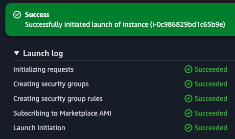
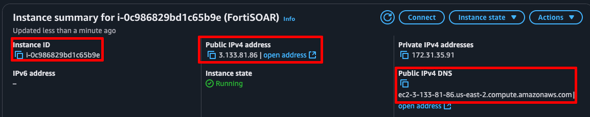
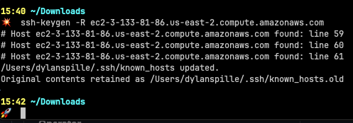
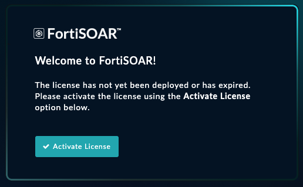
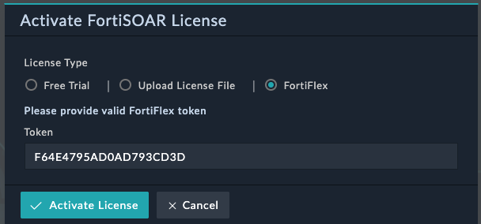
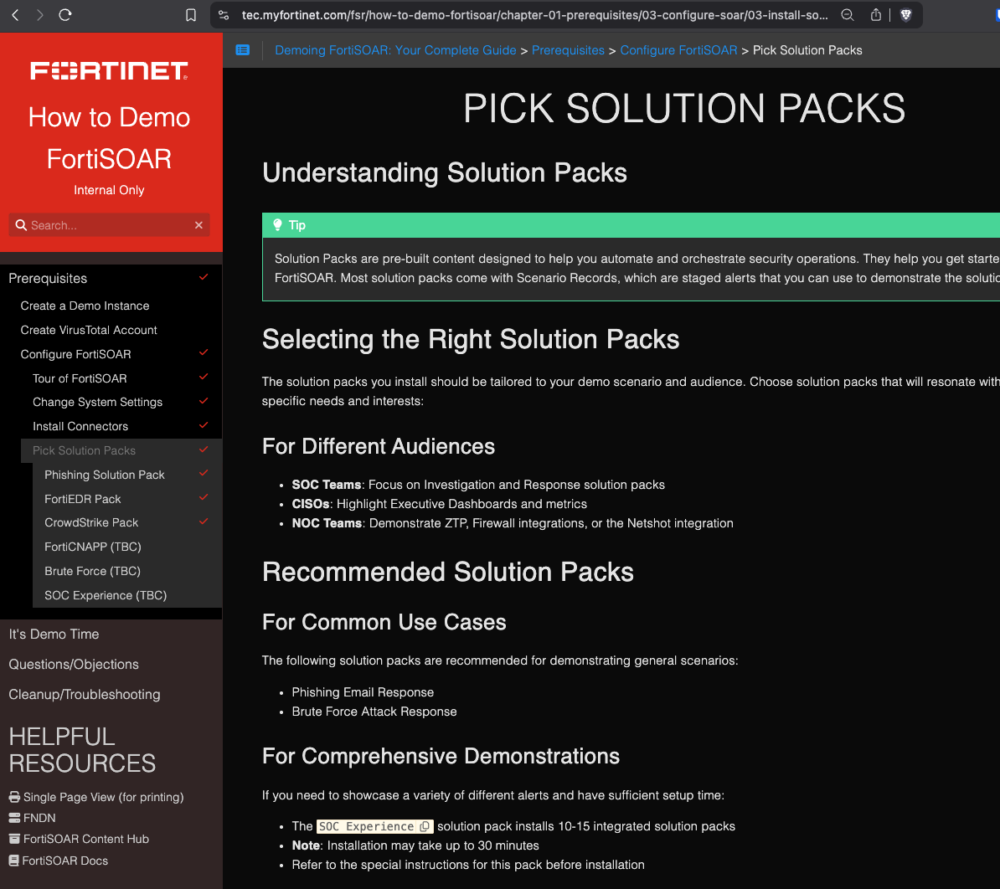

This guide will walk you through the process of deploying and configuring FortiSOAR 7.6.1 in AWS using the Marketplace AMI.

## Prerequisites

Before you begin, ensure you have:

- An AWS account with appropriate permissions
- Access to AWS Marketplace
- A FortiSOAR license or FortiFlex token

## Deployment Steps

### Step 1: Launch the FortiSOAR AMI

1. Login to AWS
2. Navigate to the **EC2 > AMI Catalog** section
3. Select the **AWS Marketplace AMI's** tab and search for "FortiSOAR"
   
4. Click on **Fortinet-FortiSOAR-AWS-Enterprise (BYOL)**, or click the **Select** button
5. Click **Subscribe Now**
   
6. Click the new option **Launch Instance with AMI**
   

### Step 2: Configure Instance

{}
FortiSOAR 7.6.1 requires a **c4.4xlarge** instance type, since there is a bug with aws nitro instances (e.g., c5, m5) that causes the FortiSOAR web UI to be inaccessible. Should be resolved in 7.6.2 - https://mantis.fortinet.com/bug_view_page.php?bug_id=1131393
{}

1. Provide the following configuration

| Field                                     | Value                                                                   |
|-------------------------------------------|-------------------------------------------------------------------------|
| **Name**                                  | `fortisoar`                                                             |
| **Instance Type**                         | `c4.4xlarge`                                                            |
| **Key Pair**                              | Create a new key pair or select an existing one                         |
| **Allow SSH traffic from**                | Your IP address only (for security)                                     |
| **Allow HTTPS traffic from the internet** | Up to you, keep in mind you may need other systems to talk to FortiSOAR |

2. Click **Launch instance**
   
3. You should see a confirmation message indicating that the instance is being launched
   
4. Wait 5-10 minutes for the instance to launch for the first time. You can check the status in the **EC2 > Instances** section of the AWS console. The instance should show a status of "running" and have a public IP address assigned.

{}
Take note of the instance id and save it, which looks something like `i-0abc123def45689`. You will need this to log in to the FortiSOAR web UI later.j

{}

## Post-Deployment Configuration

### Step 1: SSH Access

After the instance is running:

1. Ensure your SSH key has the correct permissions:

{}
{}

```bash
chmod 400 your-ssh-key.pem
```

Then connect using:

```bash
ssh -i "your-ssh-key.pem" csadmin@<instance-public-ip>
```

You can find the **Public IPv4 address** or the **Public IPv4 DNS** in the AWS console under **EC2 > Instances**.

For me, the command ended up looking like this. Yours will be different based on your instance's public IP address and pem name :wink:


Confirm the fingerprint of the host when prompted, and type `yes` to continue.


{}

{}
If using PowerShell:

```powershell
ssh -i "C:\path\to\your-ssh-key.pem" csadmin@<instance-public-ip>
```

If using PuTTY:

1. Convert the .pem file to .ppk using PuTTYgen
2. Open PuTTY and enter the host: `csadmin@<instance-public-ip>`
3. Navigate to Connection > SSH > Auth > Credentials
4. Browse and select your .ppk file
5. Click Open to connect
   {}
   {}

### Step 2: Initial System Configuration

You can use the Tab and Enter keys to navigate through the configuration wizard. You can optionally use the mouse to click on the buttons, but it's generally easier to use the keyboard.

1. The configuration wizard will start automatically upon first login. Select **Continue**
   
3. Select **Accept** to accept the EULA
4. Select **OK** to start the configuration wizard
   
5. Select **OK** to confirm the hostname
   
6. Select **OK**  to confirm the DNS server
   
7. Select **SKIP** on the proxy configuration unless you need to set one up
   
8. Select **Proceed**
   

The configuration wizard will now run and configure the system. This usually takes 10-15 minutes, and you will see various messages indicating the progress of the configuration.


{}
The configuration process will take approximately 15-20 minutes to complete.
{}

### Step 3: License Activation

1. Unfortunately, the configuration wizard changes the vm's host key, so we need to clear the old host key from our local machine. If you don't do this, you'll get a warning about the host key changing when you try to SSH back in. In the below command make sure to use the same hostname/ip that you first connected with.
    
    - On Linux/macOS, run the following command to remove the old host key:
   ```bash
   ssh-keygen -R <instance-public-ip>
   ```
   
    
    - On Windows, open `C:\Users\<your-username>\.ssh\known_hosts` in a text editor and remove the line containing the old host key for your instance.

2. SSH again to FortiSOAR using the same method as above

3. Accept the fingerprint of the host when prompted, and type `yes` to continue.
4. Run either of the following commands to retrieve the device UUID:
    ```bash
    sudo csadm license --get-device-uuid
    ```
    ```bash
    sudo cat /home/csadmin/device-uuid
    ```

2. Note down the UUID - you'll need this to link to your license on FortiCloud Asset Management

### Step 3: License Activation

{}
{}

1. Log in to your FortiCloud account
2. Navigate to Asset Management
3. Register your FortiSOAR contract with the device UUID you retrieved
4. Download the license file
   {}

{}
If you're using a FortiFlex program:

1. Retrieve your token from the FortiFlex portal
2. You'll enter this token in the FortiSOAR web UI
   {}
   {}

1. Access the FortiSOAR web interface by navigating to `https://<instance-public-ip>`
2. Accept the Insecure Connection warning in your browser (this is expected since the instance uses a self-signed certificate)
   
3. Select **Activate License** on the login page
   
4. Here you can either upload the license file you downloaded from FortiCloud or enter your FortiFlex token. You also have the option to use your FortiCloud credentials to activate the FortiSOAR Trial
   

I'm using FortiFlex in this example, so I entered my token and clicked **Activate License**.


5. After about 30 seconds you should see a message indicating that the license has been successfully activated and will use a license screen. Sroll to the bottom and click **Accept** to continue
   

### Step 4: First Login

1. Log in with:
    - Username: `csadmin`
    - Password: Your AWS instance ID (e.g., i-0abc123def456)

2. You'll be prompted to change your password on first login
   
3. After changing your password, you will be taken to the FortiSOAR Setup Guide
   

{}
Congratulations! You have successfully deployed and configured FortiSOAR 7.6.1 in AWS.
{}

## Security Considerations

{}

- Always restrict SSH access to trusted IP addresses
- Implement AWS security best practices to limit access to your instance
  {}

## Troubleshooting

{}
If you cannot connect to the FortiSOAR instance:

- Verify the security group allows traffic from your IP address
- Check that the instance is in the "running" state
- Ensure you're using the correct SSH key and username
  {}

## Next Steps

After successful deployment:

- Configure integrations with your security tools
- Install Solution Packs
- Set up user accounts and roles
- Configure notification settings

Also Check out my **How to Demo FortiSOAR** Workshop next for ideas on how to showcase FortiSOAR to your customers!

https://tec.myfortinet.com/fsr/how-to-demo-fortisoar/ 


