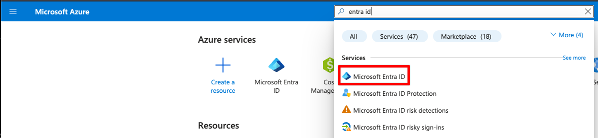
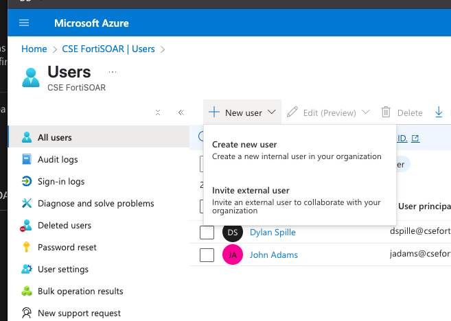
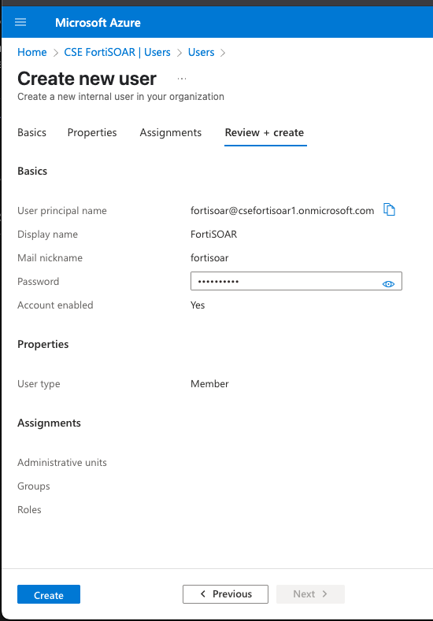
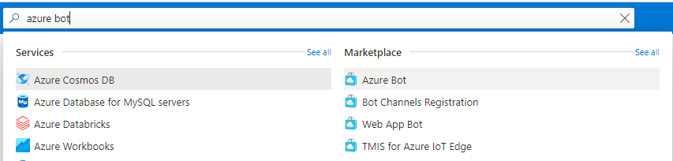
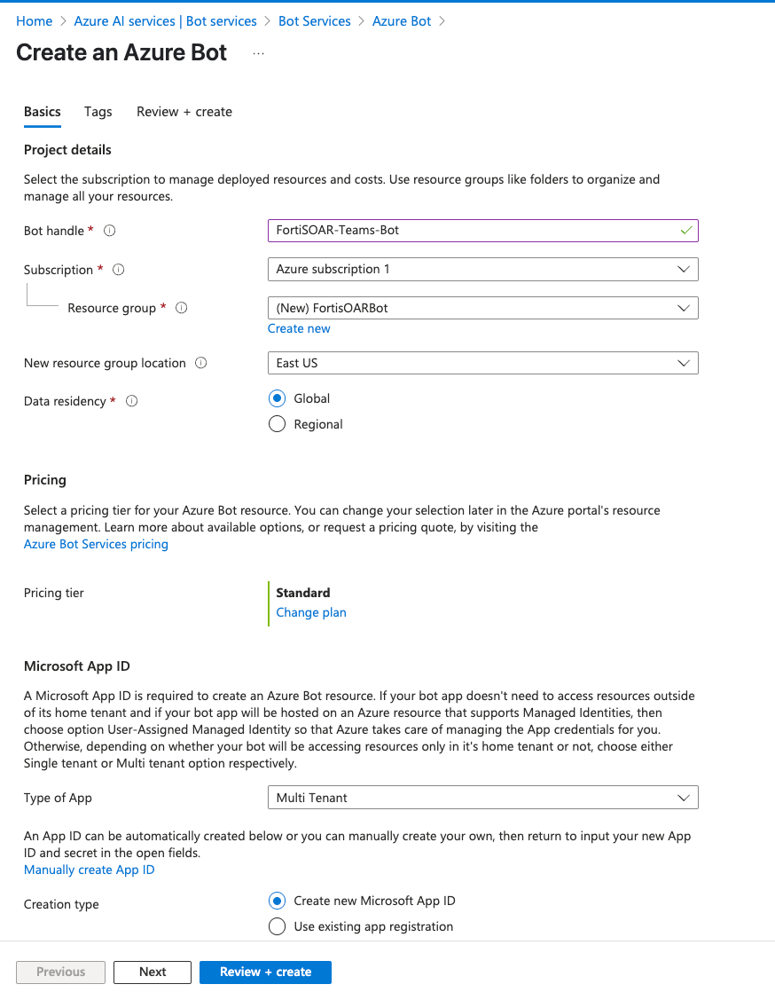
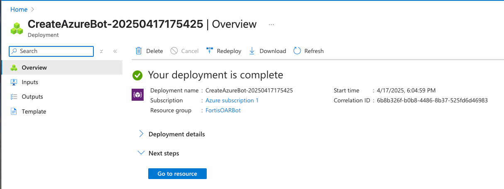

1. Create the User
Assuming you’re using Azure AD (now Entra ID):

Go to Azure Portal → Microsoft Entra ID → Users

Click + New user

Fill in user details and create the user.

2. Create a Custom Role with Required Permissions
Because your required permissions (Microsoft.BotService/*/read, etc.) are not part of built-in roles, you must create a custom role:

Go to Subscriptions or the resource group where you want this role applied.

Navigate to Access control (IAM) → Roles → + Add → Add custom role

In the wizard:

Name: BotService Manager

Permissions tab → Click + Add permissions

Search for: Microsoft.BotService

Select:

Microsoft.BotService/*/read

Microsoft.BotService/*/write

Microsoft.BotService/*/delete

Review & Create

3. Assign the Role to the User
Go to the resource group or subscription where the bots are managed.

Navigate to Access control (IAM) → + Add → Add role assignment

Choose your custom role (e.g. BotService Manager)

Assign it to the new user under Members.

### Create Azure Bot
1. Log in to the [Azure portal.](https://portal.azure.com/)
1. Search for Azure Bot in the search box on the top, then click on the link under the Marketplace section.

2. In the left panel, provide a unique name at the Bot handle, then select the Subscription, the Resource group. Set the Type of App to either Single Tenant or Multi Tenant. If the Bot will be used by multiple tenants, then select Multi Tenant.

3.  Click on the Review + Create button and if the configuration is correct the Create button again. Creating the Azure Bot may take some seconds. Azure will actually create an App Registration and a Bot Service assigned to it.

After deployment, Click **Go to Resource** 