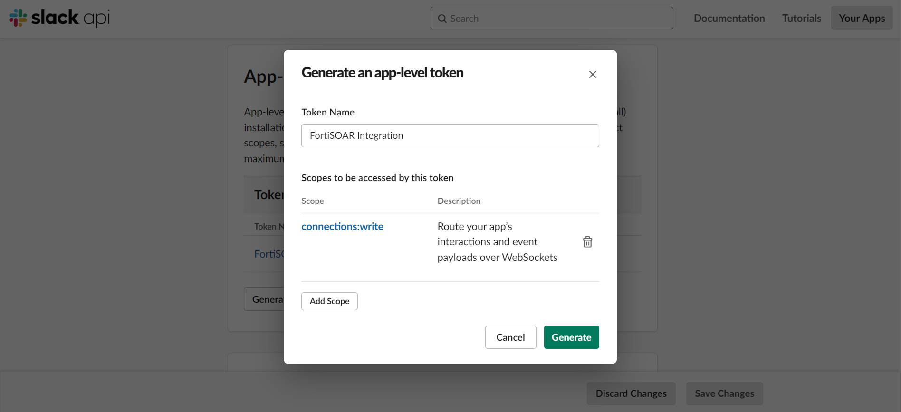
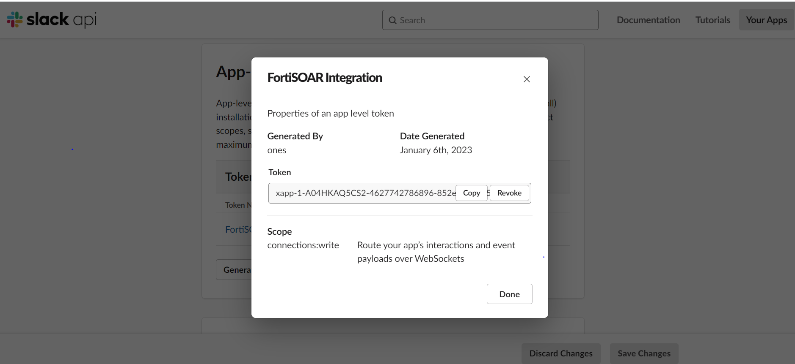
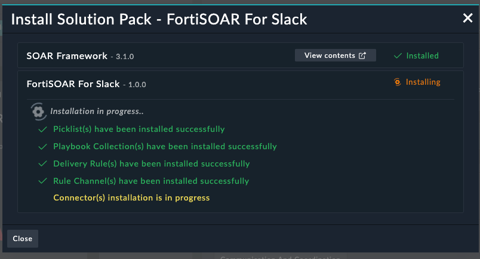
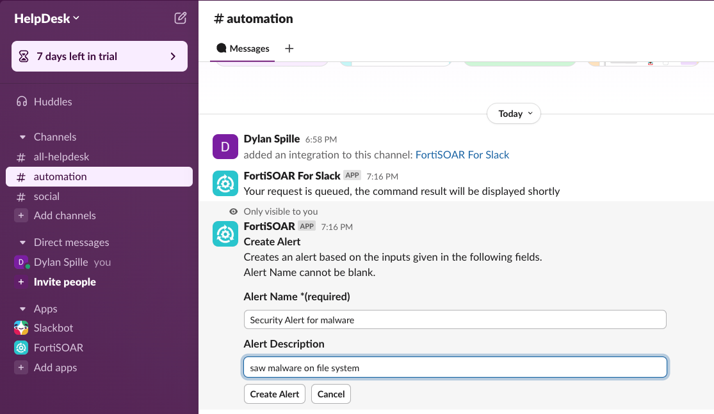
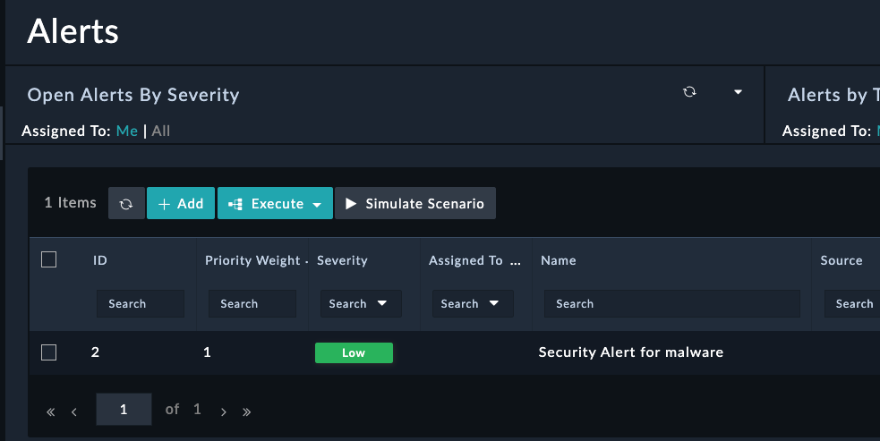
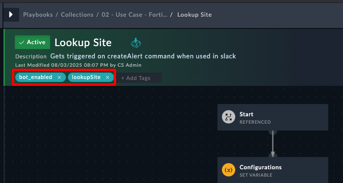
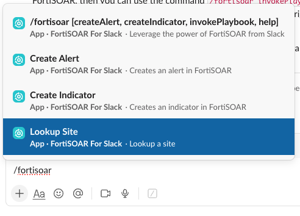

## Overview

The FortiSOAR for Slack application builds a bridge for seamless integration with FortiSOAR, allowing security teams to leverage FortiSOAR capabilities directly within Slack conversations and threat investigation workflows.

**Key Features:**

- **Slash Commands**: Trigger FortiSOAR workflows directly from Slack
- **Manual Inputs**: Collect user responses via Slack for FortiSOAR playbooks
- **Bidirectional Communication**: Enable seamless information flow between platforms

**Current Version Information:**

- FortiSOAR For Slack Application: 1.0.0
- FortiSOAR™ Tested Version: 7.3.1
- Slack Connector Tested Version: 3.0.0

## Setup Process

Setting up the FortiSOAR For Slack application requires configuration in both Slack and your FortiSOAR instance.

# Creating a Slack Account and Workspace

Before integrating FortiSOAR with Slack, you need to have a Slack account and workspace. This guide walks you through the process of creating both from scratch.

## Creating a Slack Account

1. **Visit Slack's Website**:
    - Open your web browser and navigate to [slack.com](https://slack.com/)
    - Click on the **Sign up with email** button

2. **Enter Your Information**:
    - Provide your email address
    - Check your inbox for a confirmation email from Slack
    - Follow the link in the email to confirm your account

3. **Create Your Password**:
    - Set a strong, secure password for your account
    - Complete any additional verification steps if prompted

## Creating a New Workspace

Once you have a Slack account, follow these steps to create a new workspace:

1. **Start Workspace Creation**:
    - After signing in, you'll be prompted to create a workspace
    - If not prompted automatically, click on your profile picture and select **Create a new workspace**

2. **Name Your Workspace**:
    - Enter a name for your workspace (e.g., "Company Security Team")
    - This name will appear in the Slack desktop and mobile apps

3. **Define Your Work Project**:
    - Add a brief description of what your team is working on
    - This helps Slack suggest relevant features for your needs

4. **Invite Team Members** (Optional):
    - Enter email addresses to invite colleagues to your workspace
    - You can skip this step and invite people later

5. **Set Up Channels**:
    - Slack will create default channels like #general and #random
    - You can add custom channels for specific teams or projects

## Creating Custom Channels

For FortiSOAR integration, we recommend creating a dedicated channel:

1. **Add a New Channel**:
    - In the left sidebar, click the **+** icon next to "Channels"
    - Select **Create a channel**

2. **Configure Channel Settings**:
    - Name the channel (e.g., "automation")
    - Add a description like "Channel for FortiSOAR security alerts and workflows"
    - Choose whether to make it private or public
    - Click **Create**

### 1. Adding the FortiSOAR For Slack Application to Slack

1. **Login to Slack API Portal**:
    - Visit [api.slack.com](https://api.slack.com/) and login with your Slack credentials

2. **Create a New App**:
    - Click **Your apps > Create New App**
    - Select **From an app manifest** option

3. **Select Workspace**:
    - Choose the workspace where you want to deploy the app

4. **Enter App Manifest**:
    - Copy the below `fortisoar_manifest.yml` contents
   
    ```yaml
    display_information:
      name: FortiSOAR For Slack
      description: Leverage power of FortiSOAR from Slack
      background_color: "#222424"
      long_description: "FortiSOAR App for Slack allows to invoke several commands such as creating indicator, alert, invoking playbook etc. actions.\r

        \r

        Following quick commands can be used - \r

        \r

        • Create Alert\r

        • Create Indicator\r

        • Invoke Any Playbook"
    features:
      app_home:
        home_tab_enabled: true
        messages_tab_enabled: true
        messages_tab_read_only_enabled: false
      bot_user:
        display_name: FortiSOAR
        always_online: true
      shortcuts:
        - name: Create Indicator
          type: global
          callback_id: fsr_createIndicator
          description: Creates an indicator in FortiSOAR
        - name: FSR > Enrich IP
          type: message
          callback_id: fsr_enrichIP
          description: Adds selected IP value in FSR and gets its latest reputation
        - name: Create Alert
          type: global
          callback_id: fsr_createAlert
          description: Creates an alert in FortiSOAR
      slash_commands:
        - command: /fortisoar
          description: Leverage the power of FortiSOAR from Slack
          usage_hint: "[createAlert, createIndicator, invokePlaybook, help]"
          should_escape: false
    oauth_config:
      scopes:
        bot:
          - app_mentions:read
          - bookmarks:read
          - channels:history
          - chat:write
          - chat:write.public
          - commands
          - incoming-webhook
          - pins:read
          - users.profile:read
          - users:read
          - users:read.email
          - metadata.message:read
    settings:
      event_subscriptions:
        bot_events:
          - app_home_opened
          - app_mention
      interactivity:
        is_enabled: true
      org_deploy_enabled: false
      socket_mode_enabled: true
      token_rotation_enabled: false
    ```
    
    - Select the YAML Field, since the default field is JSON
    - Paste the contents into the manifest field
    - Click **Next**

5. **Review and Create**:
    - Review the app permissions and features on the summary page
    - Click **Create**

6. **Generate App-Level Token**:
    - On the Basic Information page, scroll to **App-Level Tokens**
    - Click **Generate Token and Scopes**
    - Set a token name (e.g., "FortiSOAR Integration")
    - Add the **connections:write** scope
      
    - Click **Generate**
      
    - **Important**: Save the generated token for later configuration

7. **Add App Logo** (Optional):
    - On the Basic Information page, scroll to **Display Information**
    - Click the **Add Icon** box
    - Upload the FortiSOAR logo image
    - Click **Save Changes**

8. **Install the App**:
    - From Settings menu, click **Install app**
      
    - Click **Install to Workspace**
    - Select the channel for FortiSOAR integration. In this example we're using automation
    - Click **Allow**
      

### 2. Configuring FortiSOAR


The bi-directional communication between Slack and FortiSOAR is supported only on FortiSOAR nodes, not on FSR Agent nodes. This feature is also not supported in air-gapped environments.


1. **Install Solution Pack**:
    - Ensure the FortiSOAR For Slack Solution Pack is installed via Content Hub
      
      
    - This pack includes:
        - Slack connector
        - New notification channels for Slack
        - Delivery rules for Slack notifications
        - Pre-built playbooks for Slack integration
        - System picklist for external channels

2. **Configure Slack Connector**:
    - Ensure Slack connector version 3.0.0 or later is installed
    - Open the Slack connector configuration and enter:
        - **OAuth Token**: Copy from Slack app's OAuth & Permissions page (starts with xoxb- or xoxp-)
        - Enable "Bot Communication" checkbox
        - **App Level Token**: Paste the token generated earlier (starts with xapp-)
          

## Using the FortiSOAR For Slack Application

Once configured, the FortiSOAR For Slack app enables various integration points between the platforms.

### Supported Slash Commands

| Command | Description |
|---------|-------------|
| `/fortisoar help` | Displays available commands and usage |
| `/fortisoar availableCommands` | Lists available tags for triggering playbooks |
| `/fortisoar createAlert` | Creates an alert in FortiSOAR |
| `/fortisoar createIndicator [value]` | Creates an indicator in FortiSOAR |
| `/fortisoar invokePlaybook <tag>` | Triggers a playbook with the specified tag |

### Usage Examples

#### Creating an Alert

1. Type `/fortisoar createAlert` in your Slack channel
2. Fill in the alert details in the form that appears
   
3. Click **Create Alert**
4. The alert will be created in FortiSOAR and a confirmation message displayed
   

#### Adding an Indicator with Value

1. Type `/fortisoar createIndicator gumblar.cn` (replacing with your indicator)
2. The indicator will be added directly to FortiSOAR
3. A confirmation message will be displayed

#### Invoking a Playbook

1. Type `/fortisoar invokePlaybook enrichIP 1.1.1.1` (replacing with your IP)
2. The enrichment playbook will run and return results directly to Slack

### Manual Input from Slack

FortiSOAR allows collecting user responses via Slack with two options:

1. **Link Delivery**: Users receive a link to a form for providing input
2. **Inline Forms**: Interactive forms appear directly in Slack

When users submit their responses, the FortiSOAR playbook continues execution based on the provided input.

## Building Custom Playbooks for Slack Integration

To create custom playbooks that can be triggered from Slack:

1. **Tag Requirements**:
    - Add the `bot_enabled` tag (required)
    - Add a descriptive tag for the action (e.g., `getDomainRep`)

2. **Input Methods**:
    - **Parameters**: Define playbook parameters to accept values from Slack
    - **Manual Input**: Use for collecting multiple inputs

3. **User Context**:
    - Access current user with `vars.bot_context.user_id`
    - Access channel with `vars.bot_context.channel_id`

4. **Sending Responses**:
    - Use the Slack connector's "Send Message" action
    - Consider using a common variable (e.g., `bot_response`) for all replies

## Adding Custom Shortcuts

To add a custom shortcut for your playbook:

1. Edit the App Manifest in api.slack.com
2. Add a new shortcut entry in the YAML:
   ```yaml
   - name: FSR > Get Domain Reputation
     type: message
     callback_id: fsr_getDomainRep
     description: Retrieves reputation of submitted domain name from FortiSOAR.
   ```
3. Save changes to update your app


The callback_id must start with "fsr_" followed by the exact tag used in your FortiSOAR playbook.


## Troubleshooting

- Verify required permissions and scopes are configured correctly
- Check FortiSOAR log files for execution errors
- Ensure playbooks have both the `bot_enabled` tag and your custom tag
- Confirm the Slack connector is properly configured with valid tokens

## Further Resources

- [FortiSOAR Documentation](https://docs.fortinet.com/product/fortisoar/7.6)
- [FortiSOAR Slack Integration Docs](https://docs.fortinet.com/document/fortisoar/1.0.0/fortisoar-for-slack-application/468/fortisoar-for-slack-application-v1-0-0)
- [Slack API Documentation](https://api.slack.com/docs)
- [FortiSOAR Connectors Page](https://docs.fortinet.com/fortisoar/connectors)

## Add additional Actions to Slack

### Create Shortcut in Slack

1. Navigate to api.slack.com
2. Click **Your apps**
3. Click **FortiSOAR for Slack**
   
4. Click **Interactivity & Shortcuts** > **Create New Shortcut**
   
5. Select **Global** and click **Next**
6. Provide a meaning name, description, and CallBack ID. Callback ID will be important in SOAR later. Click **Create**
   
   {}
   The callback ID must start with `fsr_`
   {}
7. Click **Save Changes**
   

### Create Playbook in SOAR

1. Navigate to SOAR and create a new playbook.
2. It's critical for the playbook to have the tag `bot_enabled` and a tag that matches the Callback ID you created in soar WITHOUT THE FSR_, in this case, `lookupSite`
   .
   {}
   do not include the `fsr_` in the tag on the FortiSOAR playbooks
   {}

### Validate Basic Functionality

1. Back in Slack, type `/fortisoar` and make sure you see your new Shortcut
   
2. Click the new shortcut
3. Back to FortiSOAR, look at the execution history and verify that you saw the playbook execute.
4. Next, add more steps to the playbook and make sure to add steps that return feedback to the user that posted the message in Slack. 