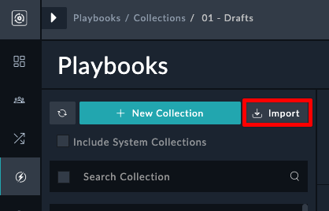
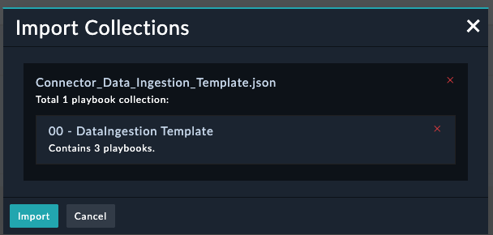
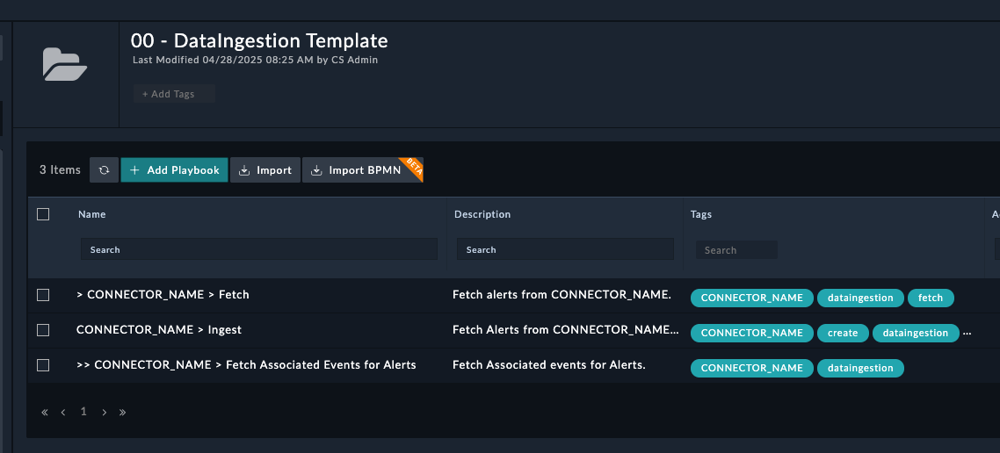
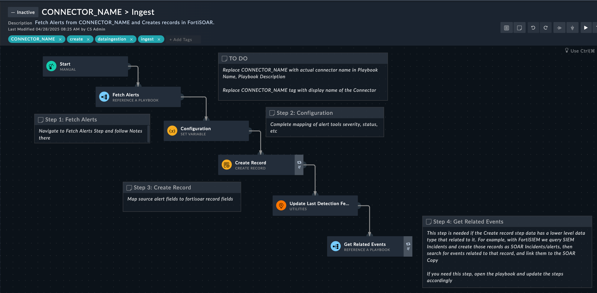

This guide walks you through the process of configuring your custom connector to support data ingestion in FortiSOAR.

## Overview

If your custom connector supports data ingestion, you'll need to make specific updates to ensure it works properly with the FortiSOAR ingestion wizard. Data ingestion in FortiSOAR follows a two-phase process: "Fetch" (pulling data from sources) and "Create" (creating records in FortiSOAR).

## Required Configuration Steps

### 1. Update the info.json File

Add the following parameters to your connector's `info.json` file:

```json
{
  "ingestion_supported": true,
  "ingestion_modes": [
    "scheduled",
    "notification",
    "app_push"
  ]
}
```

#### Ingestion Modes

- **scheduled**: Enables setup of ingestion on a schedule
- **notification**: For connectors supporting listeners for real-time ingestion
- **app_push**: For connectors where ingestion is based on pushes from the integrating application

#### Additional Preferences (Optional)

You can specify additional preferences using the `ingestion_preferences` parameter:

```json
"ingestion_preferences": {
"modules": ["threat_intel_feeds", "indicators"],
"launch_name": "My Custom Label"
}
```

- **modules**: Limit module selection to specific modules
- **launch_name**: Customize the label for the button that opens the Data Ingestion Wizard

### 2. Import Data ingestion Collection Template

{}

1. Download the above file as a json file.
2. Navigate to the Playbooks page, and click the Import Button
   
3. Select the downloaded file
4. Click Import
   
5. Open the new Collection `00 - DataIngestion Template`
   
6. Open all of these playbooks and follow the steps required to convert the template to work with your connector

CONNECTOR_NAME -> `<connector_api_name>`

#### Ingest Playbook



#### Fetch Playbook


### 2.(not recommended) Create Required Playbooks from Scratch

{}
All playbooks must be part of the 'Sample Collection' shipped with the connector and must contain these tags:

- `<connector_name>` (replace with actual connector API name)
- `dataingestion`

#### a. Fetch Playbook

This playbook pulls data from the ingestion source.

1. Must have an additional tag named `fetch`
2. The connector action step for fetching data must be named "Fetch"
3. Must have a "Set Variable" step named "Configuration" as the second step
4. Must return data in a variable named "data" as the last step


You can customize the inputs on the "Fetch Data" page by adding a "variable" called `_configuration_schema` to the "Start" step.


#### b. Create Playbook

This playbook creates FortiSOAR records for each data element fetched.

1. Must have an additional tag named `create`
2. Must have a "Create Record" step named "Create"

#### c. Ingest Playbook

This parent playbook combines both the "Fetch" and "Create" phases.

1. Must have an additional tag named `create`
2. Must invoke the "fetch" and "create" playbooks as "Reference Playbook" steps
3. For scheduled ingestions, should set the last successful pull time as the last step
   {}

## Special Considerations for Threat Intelligence Management (TIM)

If your connector supports Threat Intelligence Management:

1. Add the tag "ThreatIntel" in the connector's info.json
2. Use "Ingest Bulk Feed" step instead of "Create Record" step
3. Leverage API pagination where possible
4. Use the following function call in the connector to trigger playbooks:

```python
try:
    from integrations.crudhub import trigger_ingest_playbook
except:
    # ignore for lower FSR versions
    pass

# Function call
trigger_ingest_playbook(batch, create_pb_id, parent_env=parent_env, batch_size=1000, dedup_field="pattern")
```

## Using Custom Collections

You can build your ingestion collection separately and add these tags to the playbook collection:

1. "dataingestion"
2. "<connectorname>" (example: "malsilo")

This allows your custom collections to appear as alternatives when setting up ingestion in the Data Ingestion Wizard.

## FAQ

### Why do I need three playbooks (Fetch/Create/Ingest) instead of just one?

Data ingestion collections are invoked in two different flows:

1. For data mapping using the Data Ingestion Wizard (uses "fetch" tag)
2. For record creation through schedules or notifications (uses "ingest" tag)

Alternatively, you could use a single playbook with all three tags and use the `env_setup` variable to determine flow.

### What happens to configured ingestions when upgrading the connector?

- The ingestion will use the latest connector version if compatible
- Your previous mappings won't be lost as they're stored in a cloned collection
- Changes to connector actions will be inherited, but changes to ingestion playbooks will not