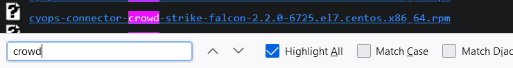
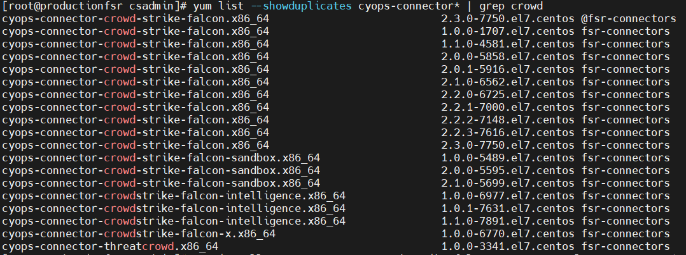
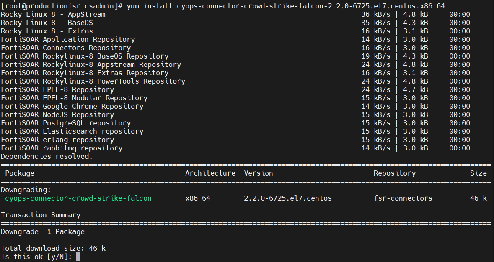

Installing older FortiSOAR content via the Content Hub UI is not supported through standard methods. This guide outlines the steps to manually install older solution packs, connectors, and widgets.

---

## Installing Older Solution Packs

To install older solution packs:

1. Navigate to the [FortiSOAR Content Hub Repository](https://repo.fortisoar.fortinet.com/content-hub/).
2. Download the desired `.zip` file.
3. Go to the **Content Hub > Manage** tab in FortiSOAR.
4. Use the **Upload** option to manually import the downloaded solution pack.

---

## Installing Older Connectors

Older connectors must be installed manually via `yum`.

### Step 1 – Identify the Package Name

#### Option 1: Browse the Repository

- Visit [https://repo.fortisoar.fortinet.com/connectors/x86_64/](https://repo.fortisoar.fortinet.com/connectors/x86_64/) and locate the desired `.rpm` package.


#### Option 2: Use `yum`

Run the following command to search for a specific connector:

```bash
yum list --showduplicates cyops-connector* | grep <partial-connector-name>
````

---

### Step 2 – Determine the Correct Package Name

* If using **Option 1**, remove the `.rpm` extension from the filename.
* If using **Option 2**, reconstruct the package name using this format:
  
  ```bash
  cyops-connector-<connector-name>-<version>-<build>.el7.centos.x86_64
  ```

**Example:**
For CrowdStrike Falcon version 2.2.0:

```bash
cyops-connector-crowd-strike-falcon-2.2.0-6725.el7.centos.x86_64
```

---

### Step 3 – Install the Connector

Use `yum` to install the package:

```bash
yum install cyops-connector-crowd-strike-falcon-2.2.0-6725.el7.centos.x86_64
```


---

## Installing Older Widgets

The process for installing older widgets is similar to solution packs.

1. Browse the [FortiSOAR Widget Repository](https://repo.fortisoar.fortinet.com/fsr-widgets/).
2. Download the appropriate `.tgz` file.
3. In FortiSOAR, go to the **Content Hub > Manage** tab.
4. Upload the widget `.tgz` file manually.

---

